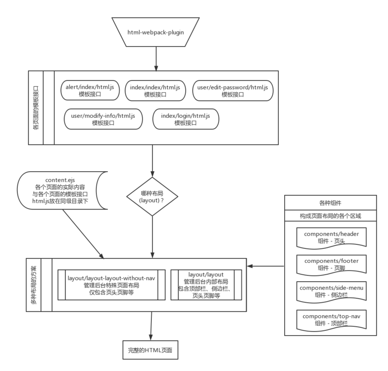

# 构建一个简单的模板布局系统

## 前言
上文《利用webpack生成HTML普通网页&页面模板》我们基本上已经搞清楚如何利用`html-webpack-plugin`来生成HTML普通网页&页面模板，本文将以我的脚手架项目[`Array-Huang/webpack-seed`](https://github.com/Array-Huang/webpack-seed)介绍如何在这基础上搭建一套简单的模板布局系统。

## 模板布局系统架构图


## 模板布局系统各部分详解
[上文](webpack-build-html-page.md)我们说到，利用模板引擎&模板文件，我们可以控制HTML的内容，但这种控制总体来说还是比较有限的，而且很大程度受限于你对该模板引擎的熟悉程度，那么，有没有更简单的方法呢？

有！我们可以就用我们最熟悉的**js**来肆意组装、拼接出我们想要的HTML！

首先来看一个上文提到的例子：

```javascript
var HtmlWebpackPlugin = require('html-webpack-plugin');
var webpackConfig = {
  entry: 'index.js',
  output: {
    path: 'dist',
    filename: 'index_bundle.js'
  },
  plugins: [new HtmlWebpackPlugin(
    title: '按照ejs模板生成出来的页面',
    filename: 'index.html',
    template: 'index.ejs',
  )],
};
```

这个例子是给`html-webpack-plugin`指定一个名为`index.ejs`的ejs模板文件，来达到生成HTML页面文件的目的，从[`html-webpack-plugin`的文档](https://github.com/ampedandwired/html-webpack-plugin/blob/master/docs/template-option.md)我们可以看出，除了默认支持的ejs外，其实还可以使用其它模板引擎（例如`jade`、`handlebars`、`underscore`）,支持的方法是在webpack配置文件中配置好相应的loader即可。

因此，我们可以推理出，`html-webpack-plugin`其实并不关心你用的是什么模板引擎，只要你的模板最后export出来的是一份完整的HTML代码（字符串）就可以了。于是，我做了一个大胆的尝试，给`html-webpack-plugin`的`template`参数指定一个js文件，然后在此js文件末尾export出一份完整的HTML代码来。这个js文件我命名为**“模板接口”**（上面架构图上有标识），意思是，不是光靠这一个js文件就能形成一份模板，“接口”之后是一套完整的**模板布局体系**。下面以webpack-seed项目里的[`src/pages/alert/index`](https://github.com/Array-Huang/webpack-seed/tree/master/src/pages/alert/index)（“消息通知”页）作为例子进行说明。

### `html-webpack-plugin`配置
先来看看我是如何给`html-webpack-plugin`指定一个js作为模板的：

```javascript
/* 
  这是用来生成alert/index页的HtmlWebpackPlugin配置
  在原项目中是循环批量new HtmlWebpackPlugin的，此处为了更容易理解，特别针对alert/index页做了修改
*/
new HtmlWebpackPlugin({
    filename: `alert/index/page.html`,
    template: path.resolve(dirVars.pagesDir, `./alert/index/html.js`), // 指定为一个js文件而非普通的模板文件
    chunks: ['alert/index', 'commons'], // 自动加载上index/login的入口文件以及公共chunk
    hash: true, // 为静态资源生成hash值
    xhtml: true,  // 需要符合xhtml的标准
});
```

### 模板接口
下面来介绍这个作为模板接口的js文件：

```javascript
/* 选自webpack-seed/pages/alert/index/html.js  */
const content = require('./content.ejs');  // 调取存放本页面实际内容的模板文件
const layout = require('layout');  // 调用管理后台内部所使用的布局方案，我在webpack配置里定义其别名为'layout'
const pageTitle = '消息通知'; // 页面名称

// 给layout传入“页面名称”这一参数（当然有需要的话也可以传入其它参数），同时也传入页面实际内容的HTML字符串。content({ pageTitle })的意思就是把pageTitle作为模板变量传给ejs模板引擎并返回最终生成的HTML字符串。
module.exports = layout.init({ pageTitle }).run(content({ pageTitle })); 
```

从代码里我们可以看出，模板接口的作用实际上就是整理好当前页面独有的内容，然后交与layout作进一步的渲染；另一方面，模板接口直接把layout最终返回的结果（完整的HTML文档）给export出来，供`html-webpack-plugin`生成HTML文件使用。

### 页面实际内容长啥样？

```ejs
<!-- 选自webpack-seed/pages/alert/index/content.ejs -->
<div id="page-wrapper">
  <div class="container-fluid" >
    <h2 class="page-header"><%= pageTitle %></h2>
    <!-- ...... -->
  </div>
</div>
```


### layout
接着我们来看看整套模板布局系统的核心——layout。layout的主要功能就是接收各个页面独有的参数（比如说页面名称），并将这些参数传入各个公共组件生成各组件的HTML，然后根据layout本身的模板文件将各组件的HTML以及页面实际内容的HTML拼接在一起，最终形成一个完整的HTML页面文档。

```javascript
/* 选自webpack-seed/src/public-resource/layout/layout/html.js */
const config = require('configModule');
const noJquery = require('withoutJqueryModule');
const layout = require('./html.ejs'); // 整个页面布局的模板文件，主要是用来统筹各个公共组件的结构
const header = require('../../components/header/html.ejs'); // 页头的模板
const footer = require('../../components/footer/html.ejs'); // 页脚的模板
const topNav = require('../../components/top-nav/html.ejs'); // 顶部栏的模板
const sideMenu = require('../../components/side-menu/html.ejs'); // 侧边栏的模板
const dirsConfig = config.DIRS;

/* 整理渲染公共部分所用到的模板变量 */
const pf = {
  pageTitle: '',
  constructInsideUrl: noJquery.constructInsideUrl,
};

const moduleExports = {
  /* 处理各个页面传入而又需要在公共区域用到的参数 */
  init({ pageTitle }) {
    pf.pageTitle = pageTitle; // 比如说页面名称，会在<title>或面包屑里用到
    return this;
  },

  /* 整合各公共组件和页面实际内容，最后生成完整的HTML文档 */
  run(content) {
    const headerRenderData = Object.assign(dirsConfig, pf); // 页头组件需要加载css/js等，因此需要比较多的变量
    const renderData = {
      header: header(headerRenderData),
      footer: footer(),
      topNav: topNav(pf),
      sideMenu: sideMenu(pf),
      content,
    };
    return layout(renderData);
  },
};

module.exports = moduleExports;
```

接下来看看layout本身的模板文件长啥样吧：

```ejs
<!-- 选自webpack-seed/src/public-resource/layout/layout/html.ejs -->
<%= header %>
<div id="wrapper">
  <%= topNav %>
  <%= sideMenu %>
  <%= content %>
</div>
<%= footer %>
```

### 组件
整个页面的公共部分，被我以区域的形式切分成一个一个的组件，下面以页头组件作为例子进行解释：

```ejs
<!DOCTYPE html>
<html lang="zh-cmn-Hans">
<head>
  <meta http-equiv="X-UA-Compatible" content="IE=edge" />
  <meta http-equiv="Content-Type" content="text/html; charset=UTF-8" />
  <title><% if (pageTitle) { %> <%= pageTitle %> - <% } %> XXXX后台</title>
  <meta name="viewport" content="width=device-width,initial-scale=1,maximum-scale=1" /> 
  <meta name="renderer" content="webkit" />

  <link rel="stylesheet" type="text/css" href="<%= BUILD_FILE.dll.css %>">
  <script type="text/javascript" src="<%= BUILD_FILE.dll.js %>"></script>
  <!--[if lt IE 10]>
    <script src="<%= BUILD_FILE.js.xdomain %>" slave="<%= SERVER_API_URL %>cors-proxy.html"></script>
    <script src="<%= BUILD_FILE.js.html5shiv %>"></script>
  <![endif]-->
</head>
<body>
  <!--[if lt IE 9]>
    <script src="<%= BUILD_FILE.js.respond %>"></script>
  <![endif]-->
```

页头组件控制的范围基本上就是整个`<head>`以及`<body>`的头部。

不要小看这`<body>`的头部，由于webpack在使用`extract-text-webpack-plugin`生成CSS文件并自动加载时，会把`<link>`放在`<head>`的最后，而众所周知，实现IE8下**Media Queries**特性的`respond.js`是需要放在css后面来加载的，因此，我们就只能把`respond.js`放到`<body>`的头部来加载了。

由于我的脚手架项目还是比较简单的，所以这些公共组件的HTML都是直接根据模板文件来输出的；如果组件本身要处理的逻辑比较多，可以使用跟**模板接口**一样的思路，利用js文件来拼接。

至于组件本身行为的逻辑(js)，可以一并放到各组件的目录里，在公共chunk里调用便是了。本文实际上只关注于如何生成HTML，这里提到这个只是提示一下组件的文件目录结构。

这里稍微再解释一下`BUILD_FILE.js.*`和`BUILD_FILE.dll.*`是什么，这些其实都是没有用webpack打包起来的js/css，我用file-loader把这些文件从src目录搬到build目录了，这里模板变量输出的都是搬运后的路径，具体请看[《听说webpack连图片和字体也能打包？》](../chapter1/webpack-image-and-font.md)。启动搬运的代码放在[`webpack-seed/src/public-resource/config/build-file.config.js`](https://github.com/Array-Huang/webpack-seed/blob/master/src/public-resource/config/build-file.config.js)。

## 总结
有了这套模板布局系统，我们就可以轻松地生成具有相同布局的多个静态页面了，**如何管理页面布局公共部分**这一多页应用的痛点也就顺利解决了。