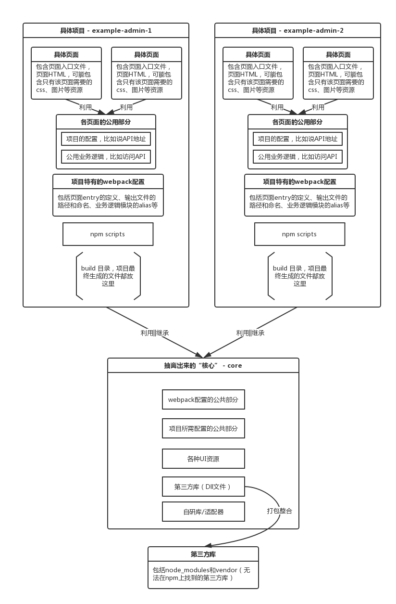

# No复制粘贴！多项目共用基础设施

## 前言
本文介绍如何在多项目间共用同一套**基础设施**，又或是某种层次的**框架**。

### 基础设施是什么？
一个完整的网站，不可能只包含一个jQuery，或是某个MVVM框架，其中必定包含了许多解决方案，例如：如何上传？如何兼容IE？如何跨域？如何使用本地存储？如何做用户信息反馈？又或者具体到如何选择日期？等等等等……这里面必定包含了UI框架、JS框架、各种小工具库，不论是第三方的还是自己团队研发的。而以上所述的种种，就构成了一套完整的解决方案，也称**基础设施**。

基础设施有个重要的特征，那就是与业务逻辑无关，不论是OA还是CMS又或是CRM，只要整体产品形态类似，我们就可以使用同一套基础设施。

### 框架
框架这个概念很泛，泛得让人心生困惑，但抽象出来说，框架就是一套定义代码在哪里写、怎么写的规则。不能说我们要怎么去**用**框架，反倒是框架**控制**我们怎么去**填**代码。

本系列前面的十来篇文章，分开来看是不同的**点**，但如果所有文章合起来，并连同示例项目（[Array-Huang/webpack-seed](https://github.com/Array-Huang/webpack-seed)），实际上阐述的就是一套完整的多页应用框架（或称架构）。这套框架规定了整个应用的方方面面，举几个例子：

- 每个页面的文件放在哪个目录？
- 页面的HTML、入口文件、css、图片等等应该怎么放？
- 编码规范（由ESLint来保证）。

当然，这只是我的框架，我希望你们可以看懂了，然后根据自己的需求来调整，变成**你们的框架**。甚至说，我自己在做不同类型的项目时，整体架构也都会有不少的变化。

## 为什么要共用基础设施/框架/架构？

### 缘起
数月前，我找同事要了一个他自己写的地区选择器，拉回来一看遍地都是ESLint的报错（他负责的项目没有用ESLint，比较随意），我这人有强迫症的怎么看得过眼，卷起袖子就开始改，改好也就正常使用了。过了一段时间，来了新需求，同事在他那改好了地区选择器又发了一份给我，我一看头都大了，又是满地报错，这不是又要我再改一遍吗？当时我就懵了，只好按着他的思路，对我的版本做了修改。从此，也确立了我们公司会有两份外观功能都一致，但是实现却不一样的地区选择器。

很坑爹是吧？

### 多项目共享架构变动
上面说的是组件级的，下面我们来说架构级别的。

我在公司主要负责的项目有两个，在我的不懈努力下，已经做到跟我的脚手架项目[Array-Huang/webpack-seed](https://github.com/Array-Huang/webpack-seed)大体上同构了。但维持同构显然是要付出代价的，我在脚手架项目试验过的改进，小至改个目录路径，大至引入个plugin啊loader啊什么的，都要分别在公司的两个项目里各做一遍，超烦哒（嫌弃脸

试想只是两个项目就已经这样了，如果是三个、四个，甚至六个、七个呢？堪忧啊堪忧啊！

### 快速创建新项目
不知道你们有没有这样子的经验：接到新项目时，灵机一动“这不就是我的XX项目吗？”，然后赶紧搬出XX项目的源码，然后删掉业务逻辑，保留可复用的基础设施。

也许你会说，这不已经比从零开始要好多了吗？总体上来说，是吧，但还不够好：

- 你需要花时间重温整个项目的架构，搞清楚哪些要删、哪些要留。
- 毕竟是快刀斩乱麻，清理好的架构比不上原先的思路那么清晰。
- 清理完代码想着跑跑看，结果一大堆报错，一个一个来调烦的要命，而且还很可能是删错了什么了不得的东西，还要去原先额项目里搬回来。

以上这些问题，你每创建一个新项目都要经历一遍，我问你怕了没有。

#### 脚手架不是可以帮助快速创建新项目吗？
是的没错，脚手架本身就算是一整套基础设施了，但依然有下列问题：

- 维护一套脚手架你知道有多麻烦吗？公司项目一忙起来，加班都做不完，哪顾得上脚手架啊。最后新建项目的时候发现脚手架已经落后N多了，你到底是用呢还是不用呢？
- 甭跟我提Github上开源的脚手架，像我这么有个性的人，会直接用那些[妖艳贱货](https://github.com/Array-Huang/webpack-seed)吗？
- 不同类型的项目技术选型不一样，比如说：需不需要兼容低版本IE；是web版的还是Hybrid App的；是前台还是后台。每一套技术选型就是一套脚手架，难道你要维护这么多套脚手架吗？

### 上述问题，通过**共用基础设施**，都能解决
- 既然共用了基础设施，要怎么改肯定都是所有项目一起共享的了，不论是组件层面的还是架构本身。
- 假设你每个不同类型的项目都已经准备好了与其它项目共用基础设施，那么，你根本不需要花费多余的维护成本，创建新项目的时候看准了跟之前哪个项目是属于同一类型的，凑一脚就行了呗，轻松。

## 怎么实现多项目共用一套基础设施呢？

### 示例项目
在之前的文章里，我使用的一直都是[Array-Huang/webpack-seed](https://github.com/Array-Huang/webpack-seed)这个脚手架项目作为示例，而为了实践**多项目共用基础设施**，我对该项目的架构做了较大幅度的调整，升级为**2.0.0**版本。为免大家看前面的文章时发现示例项目货不对板，感到困惑，我新开了一个repo来存放调整后的脚手架：[Array-Huang/webpack-seed-v2](https://github.com/Array-Huang/webpack-seed-v2)，并且，我在两个项目的README里我都注明了相应的内容，大家可不要混淆了哈。

下面就以从[Array-Huang/webpack-seed](https://github.com/Array-Huang/webpack-seed)到[Array-Huang/webpack-seed-v2](https://github.com/Array-Huang/webpack-seed-v2)的改造过程来介绍如何实现多项目共用基础设施。

### 改造思路
改造思路其实很简单，就是**把预想中多个项目都能用得上的部分从现有项目里抽离出来**。

### 如何抽离
**抽离**的说法是针对原项目的，如果单纯从文件系统的角度来说，只不过是**移动**了某些文件和目录。

移动到哪里了呢？自然是移动到与项目目录同级的地方，这样就方便多个项目引用这个**核心**了。

如果你跟我一样，在原项目中定义了大量路径和alias的话，移动这些文件/目录就只是个改变量的活了：

选自[`webpack-seed/webpack-config/base/dir-vars.config.js`](https://github.com/Array-Huang/webpack-seed/blob/master/webpack-config/base/dir-vars.config.js)：
```javascript
var path = require('path');
var moduleExports = {};

// 源文件目录
moduleExports.staticRootDir = path.resolve(__dirname, '../../'); // 项目根目录
moduleExports.srcRootDir = path.resolve(moduleExports.staticRootDir, './src'); // 项目业务代码根目录
moduleExports.vendorDir = path.resolve(moduleExports.staticRootDir, './vendor'); // 存放所有不能用npm管理的第三方库
moduleExports.dllDir = path.resolve(moduleExports.srcRootDir, './dll'); // 存放由各种不常改变的js/css打包而来的dll
moduleExports.pagesDir = path.resolve(moduleExports.srcRootDir, './pages'); // 存放各个页面独有的部分，如入口文件、只有该页面使用到的css、模板文件等
moduleExports.publicDir = path.resolve(moduleExports.srcRootDir, './public-resource'); // 存放各个页面使用到的公共资源
moduleExports.logicDir = path.resolve(moduleExports.publicDir, './logic'); // 存放公用的业务逻辑
moduleExports.libsDir = path.resolve(moduleExports.publicDir, './libs');  // 与业务逻辑无关的库都可以放到这里
moduleExports.configDir = path.resolve(moduleExports.publicDir, './config'); // 存放各种配置文件
moduleExports.componentsDir = path.resolve(moduleExports.publicDir, './components'); // 存放组件，可以是纯HTML，也可以包含js/css/image等，看自己需要
moduleExports.layoutDir = path.resolve(moduleExports.publicDir, './layout'); // 存放UI布局，组织各个组件拼起来，因应需要可以有不同的布局套路

// 生成文件目录
moduleExports.buildDir = path.resolve(moduleExports.staticRootDir, './build'); // 存放编译后生成的所有代码、资源（图片、字体等，虽然只是简单的从源目录迁移过来）

module.exports = moduleExports;
```

选自[`webpack-seed/webpack-config/resolve.config.js`](https://github.com/Array-Huang/webpack-seed/blob/master/webpack-config/resolve.config.js)：
```javascript
var path = require('path');
var dirVars = require('./base/dir-vars.config.js');
module.exports = {
  // 模块别名的配置，为了使用方便，一般来说所有模块都是要配置一下别名的
  alias: {
    /* 各种目录 */
    iconfontDir: path.resolve(dirVars.publicDir, 'iconfont/'),
    configDir: dirVars.configDir,

    /* vendor */
    /* bootstrap 相关 */
    metisMenu: path.resolve(dirVars.vendorDir, 'metisMenu/'),

    /* libs */
    withoutJqueryModule: path.resolve(dirVars.libsDir, 'without-jquery.module'),
    routerModule: path.resolve(dirVars.libsDir, 'router.module'),

    libs: path.resolve(dirVars.libsDir, 'libs.module'),

    /* less */
    lessDir: path.resolve(dirVars.publicDir, 'less'),

    /* components */

    /* layout */
    layout: path.resolve(dirVars.layoutDir, 'layout/html'),
    'layout-without-nav': path.resolve(dirVars.layoutDir, 'layout-without-nav/html'),

    /* logic */
    cm: path.resolve(dirVars.logicDir, 'common.module'),
    cp: path.resolve(dirVars.logicDir, 'common.page'),

    /* config */
    configModule: path.resolve(dirVars.configDir, 'common.config'),
    bootstrapConfig: path.resolve(dirVars.configDir, 'bootstrap.config'),
  },

  // 当require的模块找不到时，尝试添加这些后缀后进行寻找
  extentions: ['', 'js'],
};
```

### 抽离对象
抽离的方法很简单，那么关键就看到底是哪些部分可以抽离、需要抽离了，这一点看我[抽离后的成果](https://github.com/Array-Huang/webpack-seed-v2)就比较清晰了：

先来看根目录：
```bash
├─ core # 抽离出来的基础设施，或称“核心”
├─ example-admin-1 # 示例项目1，被抽离后剩下的
├─ example-admin-2 # 示例项目2，嗯，简单起见，直接复制了example-admin-1，不过还是要做一点调整的，比如说配置
├─ npm-scripts # 没想到npm-scripts也能公用吧？
├─ vendor # 无法在npm上找到的第三方库
├─ .eslintrc # ESLint的配置文件
├─ package.json # 所有的npm库依赖建议都写到这里，不建议写到具体项目的package.json里
```

再来看看`core`目录
```bash
├─ _webpack.dev.config.js # 整理好公用的开发环境webpack配置，以备继承
├─ _webpack.product.config.js # 整理好公用的生产环境webpack配置，以备继承
├─ webpack-dll.config.js # 用来编译Dll文件用的webpack配置文件
├─ manifest.json # Dll文件的资源目录
├─ package.json # 没有什么实质内容，我这里就放了个编译Dll用的npm script
├─components # 各种UI组件
│  ├─footer
│  ├─header
│  ├─side-menu
│  └─top-nav
├─config # 公共配置，有些是提供给具体项目的配置来继承的，有些本身就有用（比如说“核心”部分本身需要的配置）
├─dll # 之前的文章里就说过，我建议把各种第三方库（包括npm库也包括非npm库）都打包成Dll来加速webpack编译过程，这部分明显就属于基础设施了
├─iconfont # 字体图标能不能公用，这点我也是比较犹豫的，看项目实际需要吧，不折腾的话还是推荐公用
├─layout # 布局，既然是同类型项目，布局肯定是基本一样的
│  ├─layout
│  └─layout-without-nav
├─less # 样式基础，在我这项目里就是针对bootstrap的SB-Admin主题做了修改
│  ├─base-dir
│  └─components-dir
├─libs # 自己团队研发的一些公共的方法/库，又或是针对第三方库的适配器（比如说对alert库封装一层，后面要更换库的时候就方便了）
├─npm-scripts # 与根目录下的npm-scripts目录不一样，这里的不是用来公用的，而是“核心”使用到的script，比如我在这里就放了编译dll的npm script
└─webpack-config # 公用的webpack配置，尤其是关系到“核心”部分的配置，比如说各第三方库的alias。这里的配置是用来给具体项目来继承的，老实说我现在继承的方法也比较复杂，回头看看有没有更简单的方法。
    ├─base
    ├─inherit
    └─vendor
```

最后总结一下，是哪些资源被抽离出来了：
- webpack配置中属于架构的部分，比如说各种loader、plugin、“核心”部分的alias。
- “核心”部分所需的配置，比如我这项目里为了定制bootstrap而建的配置。
- 各种与UI相关的资源，比如UI框架/样式、UI组件、字体图标。
- 第三方库，以Dll文件的形式存在。
- 自研库/适配器。

## 结构图

